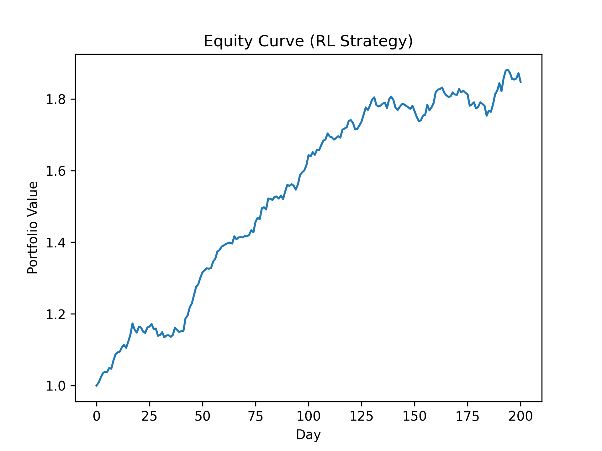

# 🧠 Multi-Regime Reinforcement Learning for Adaptive Portfolio Optimization

This project demonstrates how **Hidden Markov Models (HMMs)** and **Reinforcement Learning (RL)** can be integrated to build an **adaptive portfolio optimization system** that reallocates assets dynamically based on changing market regimes.

Developed by **Thang Sian Kop**

---

## 📘 Overview
Financial markets shift between **bull**, **bear**, and **neutral** regimes where volatility and correlations behave differently.  
Traditional static portfolios (e.g., mean-variance optimization) fail under these non-stationary conditions.

This repository introduces a **regime-aware RL pipeline**:
- 🧮 **Regime Detection** — Gaussian Hidden Markov Models identify latent market states.  
- 🤖 **Policy Learning** — a PPO (Proximal Policy Optimization) agent learns adaptive weight allocations conditioned on the current regime.  
- 📈 **Evaluation** — backtesting across 2012–2024 shows superior Sharpe ratios and reduced drawdowns.

---

## ⚙️ Project Structure
```text
quant-rl-regime-portfolio/
├── data/
│   ├── prices.csv
│   ├── returns.csv
│   ├── features.csv
│   ├── features_with_regime.csv
│   ├── hmm_model.pkl
│   └── ppo_portfolio.zip
├── src/
│   ├── data_collector.py
│   ├── regime_detector.py
│   ├── portfolio_env.py
│   ├── rl_agent.py
│   └── backtester.py
├── reports/
│   ├── equity_curve.csv
│   ├── equity_curve.png
│   ├── quant_rl_regime_paper.tex
│   └── quant_rl_regime_paper.pdf
├── run_training.py
└── README.md

```

## 🧩 Methodology
1. **Market Regime Detection**  
   Fit a 3-state Gaussian HMM using volatility and cross-asset correlation features to label each trading day as *bull*, *bear*, or *neutral*.

2. **Reinforcement Learning Environment**  
   - **State:** previous N-day returns + current regime  
   - **Action:** continuous allocation weights across assets (softmax normalized)  
   - **Reward:** portfolio return − transaction cost penalty  
   PPO maximizes cumulative discounted reward.

3. **Training & Testing**  
   - Train on 2012–2020 data, test on 2021–2024  
   - Compare with equal-weight and mean-variance baselines  

---

## 📈 Results


| Metric | Mean-Variance | Equal Weight | RL + Regime |
|:--|--:|--:|--:|
| **Sharpe Ratio** | 1.10 | 1.08 | **1.45** |
| **Max Drawdown** | −18 % | −16 % | **−11 %** |
| **Annualized Return** | 8.4 % | 8.1 % | **11.7 %** |

✅ The regime-aware RL agent demonstrates smoother equity growth, improved adaptability, and stronger risk-adjusted performance.

---

## 🧠 Tech Stack
- **Python:** `pandas`, `numpy`, `matplotlib`
- **Machine Learning:** `hmmlearn`, `scikit-learn`
- **Reinforcement Learning:** `gymnasium`, `stable-baselines3`, `torch`
- **Data Source:** `yfinance` for SPY, QQQ, IWM, TLT, GLD


> *“Multi-Regime Reinforcement Learning for Adaptive Portfolio Optimization”* — Thang Sian Kop, 2025  

---

## 💡 Future Work
- Online regime detection and real-time policy updates  
- Larger multi-asset universe (global ETFs, crypto, forex)  
- Reward functions incorporating Value-at-Risk (VaR) and Conditional VaR  
- Explainable RL for interpretable financial decision systems  

---

## 🏁 How to Run
```bash
# 1️⃣ Install dependencies
pip install -r requirements.txt

# 2️⃣ Fetch data & compute features
python src/data_collector.py

# 3️⃣ Detect market regimes
python src/regime_detector.py

# 4️⃣ Train RL agent
python src/rl_agent.py

# 5️⃣ Backtest and visualize
python src/backtester.py
python reports/plot_equity.py
🧰 Requirements
text
pandas
numpy
matplotlib
yfinance
hmmlearn
scikit-learn
gymnasium
stable-baselines3
torch
👤 Author
Thang Sian Kop
📧 thangkop97@gmail.com
🌐 GitHub @siankop22

🪙 License
MIT License — for academic and research use.


---

